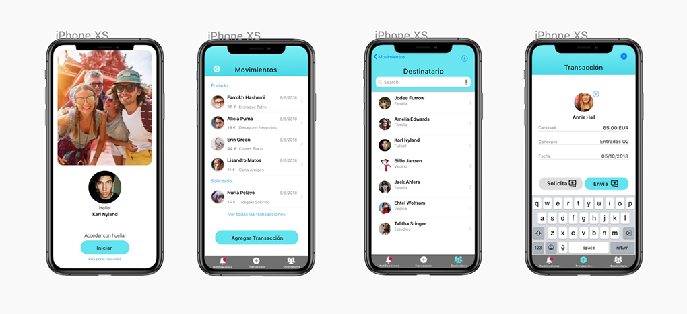

## Practica de Diseño en Sketch Diseño de interfaces  ##

## Practica de Diseño de Interfaces BootCamp Keepcoding  ##

### Explica las decisiones más importantes que has tomado y que consideres más importante. Máximo dos párrafos.

Mi propuesta se basa en un diseño muy claro, usando color azul que es un color que transmite confianza y tranquilidad, la disposición de elementos muy limpios dejando el blanco predominante en la interfaz. Se ha reforzado el uso de iconos en el tabbar para ayudar a la persona que lo use familiarice con la interfaz.Dejando abierta una evolución con menos elementos a futuro, y por último se incluyen iconos en los botones para que la decisión al seleccionarla quede más claro.

### Desde el punto de vista humano, ¿que cuestiones crees que son clave?. Desarrollar en un solo un párrafo.

He querido hacer la interfaz  mas humana mostrando  caras y nombres y sobre todo destacando los botones solicitar y enviar para dejar clara la operación
Lo importante son las **personas** (amigos) y la **operacion** en si (transacción)

### ¿Qué onboarding crees que sería el adecuado? Desarrollar en un solo un párrafo.

Mostraría ejemplos básicos del uso de la app así como  situaciones ideales a usar la app.

**Nota Adicional:**
La seccion ajustes, seria para temas de login, notificaciones basicamente
Estaria pendiente una prueba practica de uso con personas ajenas a la app e ir puliendo la disposicion de elementos y hacerla mas intuitiva de ser posible

